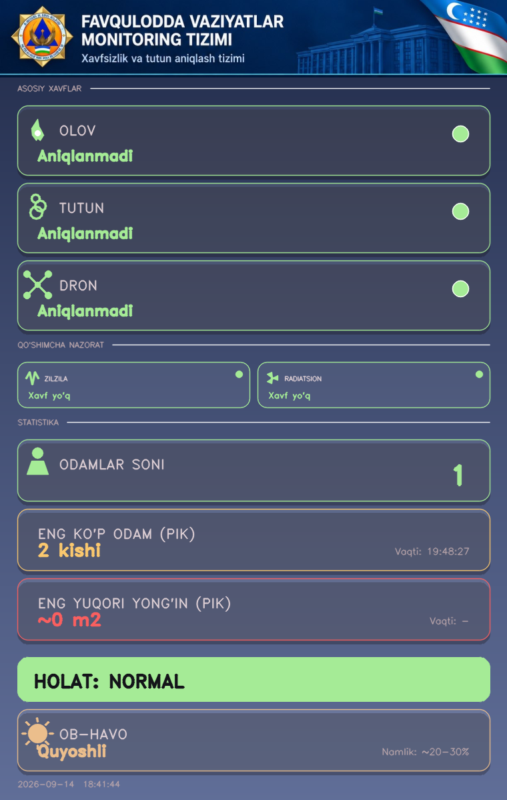
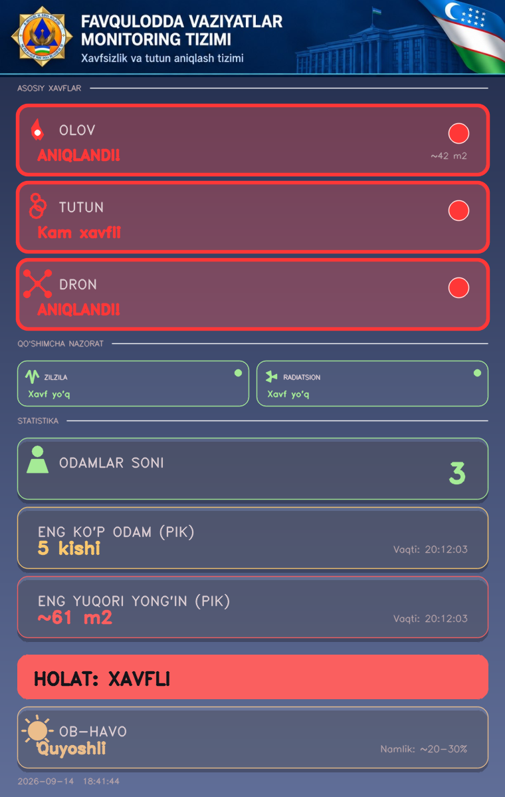
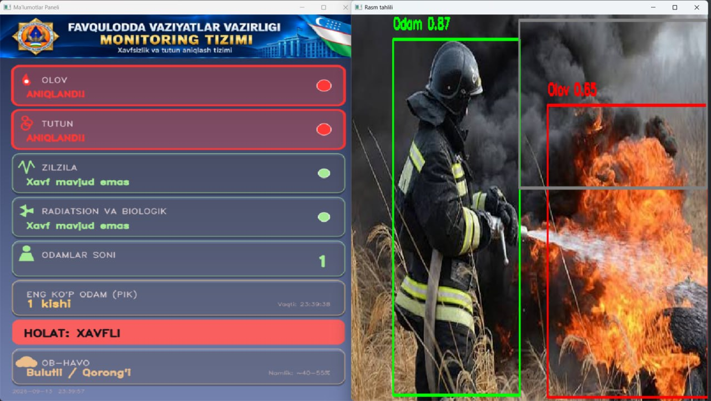
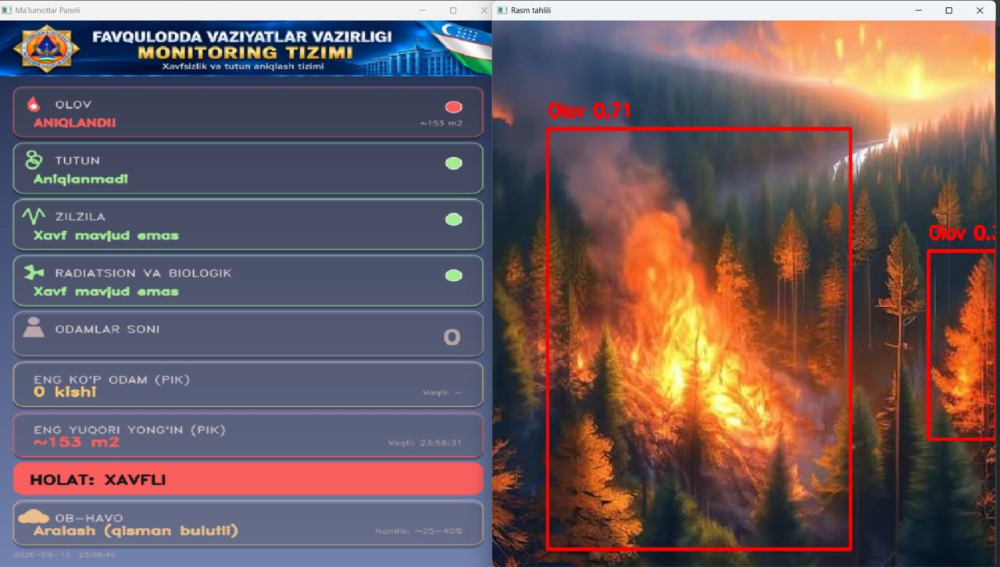
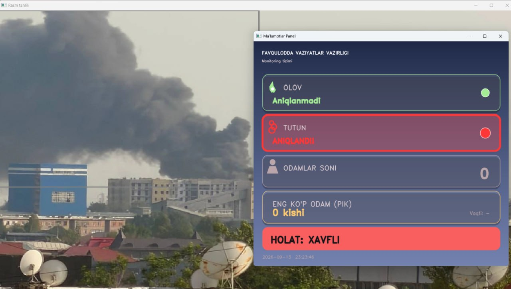

# Favqulodda Vaziyatlar Monitoring Tizimi

Real-time fire, smoke, drone, and person detection dashboard built with YOLOv8 and OpenCV. Designed as a concept monitoring panel in the style of an emergency-services control room UI.

> Commissioned by a representative of the Ministry of Emergency Situations of Uzbekistan (Favqulodda Vaziyatlar Vazirligi) as a concept monitoring dashboard. Not an officially deployed government system.

Intended deployment: mounted on a drone's onboard camera for aerial patrol, giving early visual warning of fire, smoke, unauthorized drones, and crowd buildup — aimed at protecting civilians and helping prevent emergency situations before they escalate.




## Screenshots

| Fire + person detected | Wildfire detection |
|---|---|
|  |  |

| Smoke detected |
|---|
|  |

## Features

- **Person detection** — YOLOv8n (COCO), live count + all-time session peak with timestamp
- **Fire & smoke detection** — fine-tuned YOLOv8 ([rabahdev/fire-smoke-yolov8n](https://huggingface.co/rabahdev/fire-smoke-yolov8n)), with a basic HSV color-heuristic fallback when no model is present
- **Drone detection** — fine-tuned YOLOv8 ([Tuzelkhan/drone-yolov8](https://huggingface.co/Tuzelkhan/drone-yolov8))
- **Live camera capture** — built-in webcam by index, or any IP/RTSP camera stream via a small source-selection window
- **Custom-drawn dashboard UI** — dark glassmorphism panel rendered entirely with OpenCV primitives (no external UI framework), with a blinking alert state on active fire/smoke/drone detections
- **Approximate burn-area estimate** (m²) based on a configurable frame-coverage constant
- **Session peak tracking** for person count and fire area, reset on every restart
- **Packagable to a single Windows `.exe`** via PyInstaller

## Tech stack

`Python` · `OpenCV` · `Ultralytics YOLOv8` · `NumPy` · `Tkinter` (camera source dialog) · `PyInstaller`

## Setup

```bash
pip install -r requirements.txt
```

Place these files next to `fire_detect_panel.py`:

| File | Required | Source |
|---|---|---|
| `yolov8n.pt` | yes | auto-downloaded by `ultralytics` on first run |
| `header_banner.png` | optional | your own banner image |
| `best.pt` | optional | fire/smoke model — see below |
| `drone.pt` | optional | drone model — see below |

Without `best.pt` / `drone.pt` the app still runs — fire falls back to a (much less reliable) color heuristic, and the drone card simply stays "not detected."

### Download the fire/smoke and drone models

```bash
pip install huggingface_hub
python -c "
from huggingface_hub import hf_hub_download
import shutil
shutil.copy(hf_hub_download('rabahdev/fire-smoke-yolov8n', 'best.pt'), 'best.pt')
shutil.copy(hf_hub_download('Tuzelkhan/drone-yolov8', 'best.pt'), 'drone.pt')
"
```

### Run

```bash
python fire_detect_panel.py
```

## Building a standalone .exe

```bash
pyinstaller --onefile --console --icon=logo.ico \
  --add-data "header_banner.png;." \
  --add-data "yolov8n.pt;." \
  --add-data "best.pt;." \
  --add-data "drone.pt;." \
  --hidden-import ultralytics --hidden-import tkinter \
  --name FavqulоddaMonitoring fire_detect_panel.py
```

## Notes / known limitations

- The burn-area (m²) figure is a rough estimate driven by a configurable `FRAME_AREA_M2` constant, not real camera geometry (distance/FOV) calibration.
- The "earthquake" and "radiological/biological" cards are static placeholders — there is no seismic or radiation sensor input in this build; they're there to represent a fuller emergency-monitoring concept.
- The color-heuristic fire fallback (used only when `best.pt` is absent) is unreliable in direct sunlight / warm-toned scenes and should not be relied on for real detection.

## License

Personal / portfolio project.
